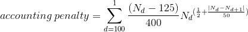
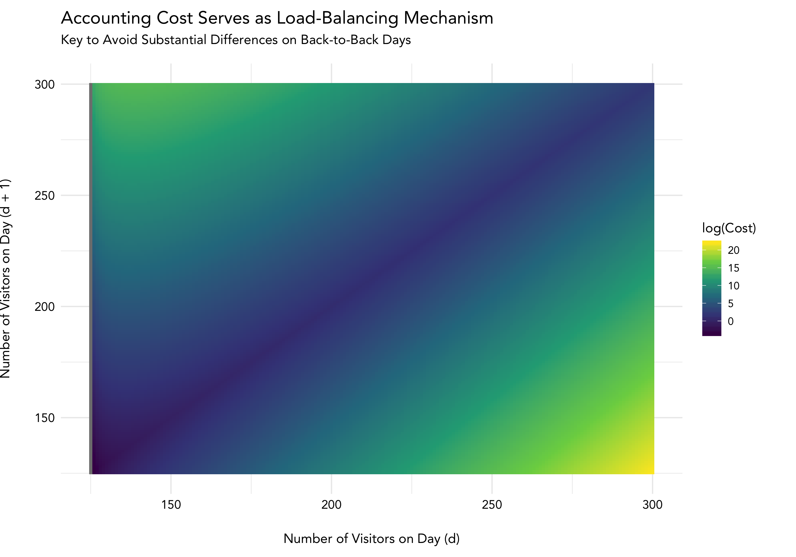
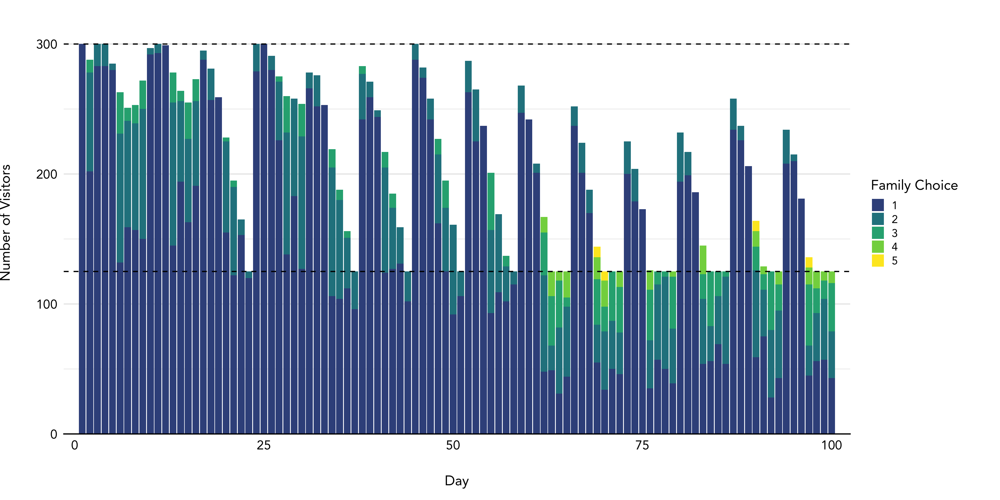

# Kaggle Competition: Santa's Workshop Tour 2019

The objective of this Kaggle competition, [as detailed here](https://www.kaggle.com/c/santa-workshop-tour-2019/overview/description), was to minimize the costs associated with 5,000 families visiting Santa's workshop over a 100-day period. Each family provides a list of their top 10 preferred days on which to visit, and there is a hard constraint which states that Santa's workshop must host between 125 and 300 individuals on each of the 100 days.

When a family is not assigned to visit on their most preferred day, there is a preference cost administered, in the form of various gift cards and vouchers issued to each family member. These penalties are linear by nature.

Additionally, a non-linear accounting cost is administered as a load-balancing mechanism. This heavily penalizes instances in which two consecutive days have significantly different attendance figures.

With the exception of the third attempt, all of my solutions were implemented using Gurobi and its Python API.

## Exploratory Analysis

## Solving the Model
### First Attempt
To begin, I focused solely on minimizing the linear preference cost &mdash; yielding a value of $42,622. When the accounting cost was administered to this solution, however, the total cost quickly ballooned to $15,374,155,363. 

From here, I applied a greedy heuristic, which sought to move families one-by-one, without violating any of the constraints, in order to continue minimizing the overall cost. After allowing this to run for about 8 hours, I was able to reduce the cost to $223,278.

### Second Attempt
Here, my overall approach was very similar to the first attempt. However, after staring at the accounting penalty for a while, I came to realize that a constant fluctuation in daily attendance figures was extremely detrimental. In other words, if I could put an upper limit on the difference between attendances for each set of consecutive days, I would have a much better initial solution, before I applied the greedy heuristic.

After some configuration of that soft constraint, I was able to reach an initial overall cost in the $76,900s.

### Third Attempt
In order to reach the true optimum, as I had by this point seen others on the leaderboard achieve, I realized I would have to solve the full problem, without any heuristics.

Naively, I thought I would be able to solve this while retaining the non-linearities of the objective function. So, I taught myself enough Julia to construct that model using [JuMP](http://www.juliaopt.org/JuMP.jl/v0.19.0/) and the open-source [Ipopt](https://github.com/JuliaOpt/Ipopt.jl) solver &mdash; with very little success. Suffice it to say this was not a useful detour. 

### Fourth Attempt
Further thought, aided by closer review of the discussion board and public kernels, finally led me to the conclusion that I could linearize the accounting costs &mdash; indexing them by the day, that day's attendance, and the previous day's attendance. This yielded an additional 3 million-plus variables, but it also transformed the whole prompt into a mixed integer linear programming (MILP) problem.

I don't recall how long I allowed for Gurobi to reach a solution during this attempt, but it did not. I do now know that I was missing a set of constraints, however, so this model branched at $65,303, as opposed to the desired $67,309.

### Fifth Attempt
This was a carbon copy of the fourth attempt, with two exceptions: First, [per this helpful thread on the discussion board](https://www.kaggle.com/c/santa-workshop-tour-2019/discussion/122660), I removed all variables with accounting costs exceeding $6,500. (By this point, it was well-established that the accounting cost in the optimal solution was $6,020.04, and I was more desperate to reach the optimal solution at all than I was to reach it the *right way*.) Second, I used the solution from the second attempt to warm start the model.

After approximately 60 hours of runtime on a laptop with a 2.7 GHz Intel Core i5 processor and 8 GB of RAM, I reached a cost of $69,698.36 before terminating the model.  

### Sixth Attempt
This attempt was relatively short-lived, and I was never really sold on the idea that it would work. Given that it was already made known what each of the preference and accounting costs in the optimal solution were, I tried solving for just the preference cost &mdash; with the hard constraint that the objective function must equal $62,868 &mdash; using different random seeds.

I moved on after 100 attempts. The best objective value from this experiment exceeded $30 million.

### Seventh Attempt
Here, I realized I was missing the set of constraints which forcibly linked the accounting cost variables for each set of consecutive days. After implementing this change, the model finally branched at $67,309.11 as expected. On a laptop with a 2.4 GHz Intel Core i5 processor and 16 GB of RAM, this model reached its first feasible solution of $87,332.10 after just 44 minutes. I interrupted this run every now and again to adjust the `MIPFocus`, `Cuts`, and `Cutoff` parameters, and I terminated it for good after about 75 hours, with an objective value function of $68,922.93.

I subsequently used that solution as a warm start to the same model on a laptop with a 2.8 GHz Intel Core i7 processor and 16 GB of RAM, yielding a slight improvement to $68,913.97 after about 8 hours. This run was terminated after 39 hours, with the lower bound still in the $68,770s.

### Eighth Attempt
For what I hoped will be the final attempt, I further reduced the size of the model, first removing any accounting cost variables with values exceeding $300. After an audit of previous solutions, I recognized that *all* families were assigned to days which were one of their top five preferences, so I thought it would be safe to also remove any preference variables which represented days that were *not* a top-10 choice of each family. I also moved the model to a standard server on DigitalOcean with 16 vCPUs and 64 GB of RAM, and I resolved to be much more patient than I had been up to this point.

The model returned what ended up being my best solution &mdash; $68,898.25 &mdash; after about 17 hours, when seeded with a solution with an objective value of $77,251.19. The solution did not improve after this, and there was very little movement on the lower bound, so I stopped this execution after about 48 hours.

I tried one last time on the same server, beginning this execution with a $70,229.21 solution. This ran for 28 hours &mdash; right up to the Kaggle submission deadline &mdash; but its best solution by that point was $68,920.92.

## Final Submission
Although I was a bit disappointed not to be among those with an optimal solution ($68,888.04), I did get very close ($68,898.25), and I did earn a silver medal, despite having very little experience with an optimization problem of this size and complexity. Below is a look at how the 5,000 families were distributed in my final solution, by day and by ordered choice. This visualization was inspired by [another user's public notebook](https://www.kaggle.com/ghostskipper/visualising-results).

